[TOC]
# 1. 理论基础
##  1.1. 第一章 线性代数
### 1.1.1. 向量空间和向量
- 线性代数的基本概念是向量空间
- 我们最感兴趣的向量空间是所有$n$元复数组成的向量空间$\mathbb{C}^n$
- 向量空间的元素称为向量，我们有时用列矩阵记号$
\begin{bmatrix}
z_1\\
\vdots\\
z_2
\end{bmatrix}
$来表示向量。
- 对于这些线性代数概念我们将使用量子力学的标准记号,这些符号都统一归为狄拉克符号，比如向量空间中的向量的标准量子符号为$\ket{\psi}$，后续我们会遇到更多狄拉克符号。

### 1.1.2. 线性相关性
- 对于非零向量集$\ket{v_1},\cdots,\ket{v_2}$，若存在一个复数集合$a_1,\cdots,a_n$，其中至少一个$a_i\neq0$，使得$\sum_ia_i\ket{v_i}=0$，则称其为线性相关的，否则为线性无关的。

### 1.1.3. 向量空间的基
- 如果向量空间$V$的生成集$\ket{v_1},\cdots,\ket{v_2}$，则该向量空间的任意一个向量$\ket{v}$都能写成该向量集中向量的线性组合$\ket{v}=\sum_ia_i\ket{v_i}$，同时我们可以说向量集$\ket{v_1},\cdots,\ket{v_2}$张成了向量空间$V$。
- 一个向量空间也可以有不同的生成集。
- 任何两个张成向量空间的线性无关向量组所含元素的个数是相同的，这样的向量组集合是向量空间的一组基。
- 向量空间的一组基的元素个数对应了向量空间的维数。

### 1.1.4. 线性算子
- 向量空间$V$和$W$之间的线性算子定义为对输入具有线性性质的映射$A:V\to W$:$A(\sum_ia_i\ket{v_i})=\sum_ia_iX(\ket{v_i})$。
- 恒等算子$I_V$，对于任意的向量$\ket{v}$，$I_V\ket{v}=\ket{v}$。在不会混淆时可直接用$I$表示。表示为$\begin{bmatrix}
    1 & 0 & \dots & 0&0 \\
0 & 1 & \dots & 0&0 \\
\vdots & \vdots & \ddots & \vdots &0\\
0& 0&\dots& 1&0\\
0 &0 & \dots & 0&1
\end{bmatrix}$，即正对角线上的所有元素都为1，其余为0。
- 零算子$0$，即把所有向量都映射成零向量。
- 线性算子和矩阵是等价的。
- $A$：$V \to W  $，$\ket{v_1},\ket{v_2},\dots,\ket{v_n}$是$V$的一组基，$\ket{w_1},\ket{w_2},\dots,\ket{w_m}$是$W$的一组基，则对$1,2,\dots,  n$中任意的$j$，都存在复数$A_{1j}$到$A_{nj}$，使得$A\ket{v_j}=\sum_iA_{ij}\ket{w_i}$。
- 要在任意情况下求得线性算子A
    -  输入基$\ket{v_1},\ket{v_2},\dots,\ket{v_n}$和输出基$\ket{w_1},\ket{w_2},\dots,\ket{w_m}$
    -  线性映射的方式： $A\ket{k_j}=\sum_iX_{ij}\ket{w_i}$，其中$\ket{k_j}=\sum_iY_{ij}\ket{v_i}$
    -  得出$A=YX^{-1}$。（当向量空间的输入基和线性映射的输入基相同时，$X=I_V$）

>设$A$是一个$m \times n$矩阵，$B$是一个$n \times p$矩阵，那么它们的乘积$C = AB$是一个$m \times p$矩阵，其中第$i$行第$j$列的元素$c_{ij}$定义为：$c_{ij} = \sum_{k=1}^n a_{ik} b_{kj}$。
$$
\begin{bmatrix}
a_{11} & a_{12} & \dots & a_{1n} \\
a_{21} & a_{22} & \dots & a_{2n} \\
\vdots & \vdots & \ddots & \vdots \\
a_{m1} & a_{m2} & \dots & a_{mn}
\end{bmatrix}
\begin{bmatrix}
b_{11} & b_{12} & \dots & b_{1p} \\
b_{21} & b_{22} & \dots & b_{2p} \\
\vdots & \vdots & \ddots & \vdots \\
b_{n1} & b_{n2} & \dots & b_{np}
\end{bmatrix}=
\begin{bmatrix}
c_{11} & c_{12} & \dots & c_{1p} \\
c_{21} & c_{22} & \dots & c_{2p} \\
\vdots & \vdots & \ddots & \vdots \\
c_{m1} & c_{m2} & \dots & c_{mp}
\end{bmatrix}$$
其中C的子列矩阵为对应的B的子列矩阵映射得到$\begin{bmatrix}
    c_{1i}\\
c_{2i}\\
\vdots\\
c_{ni}
\end{bmatrix}=\begin{bmatrix}
a_{11} & a_{12} & \dots & a_{1n} \\
a_{21} & a_{22} & \dots & a_{2n} \\
\vdots & \vdots & \ddots & \vdots \\
a_{m1} & a_{m2} & \dots & a_{mn}
\end{bmatrix}
\begin{bmatrix}
    b_{1i}\\
b_{2i}\\
\vdots\\
b_{ni}
\end{bmatrix}$

### 1.1.5. 内积和外积

内积是从向量空间中取两个向量$\ket{v}$和$\ket{w}$作为输入然后输出一个复数的函数，其标准量子符号为$\langle v\ket{w}$，计算方式为$\langle v\ket{w}=\begin{bmatrix}
    x_1\\x_2\\ \vdots \\x_n
\end{bmatrix}^*
\begin{bmatrix}
y_1\\y_2\\\vdots\\y_n
\end{bmatrix}=\begin{bmatrix}
    x_1^*&x_2^*&\dots&x_n^*
\end{bmatrix}
\begin{bmatrix}
y_1\\y_2\\\vdots\\y_n
\end{bmatrix}=\sum_ix_i^*y_i$。我们称定义了内积的向量空间为内积空间。
- 内积对于第一个参数是共轭线性的，对于第二个参数是线性的。
- 如果向量$\langle v\ket{w}=0$，那么$$和$$是正交的。
- 我们定义$\ket{v}$的范数为$\|\ket{v}\|=\sqrt{\langle v\ket{v}}$。
- 如果$\|\ket{v}\|=1$，则称$\ket{v}$是正规化的，可作为单位向量。正规化一个向量就用此向量除以他的范数。
- 如果一个向量集的每一个向量都是单位向量且互相正交，那么此向量集为标准正交的。
- 内积表示一个向量在另一个向量上的投影乘以另一个向量。它在量子计算中代表从一个态$\ket{\psi}$转变到另一个态$\ket{\varphi}$的复振幅。
>格拉姆-施密特正交法
假设$\ket{w_1},\dots,\ket{w_d}$是向量空间$V$的一组基，定义$\ket{v_1}=\frac{\ket{w_1}}{\|\ket{w_1}\|}$，并且对于$1\leq k \leq d-1$，归纳地定义$\ket{v_{k+1}}=\frac{\ket{w_k+1}-\sum_{i=1}^k\langle v_i\ket{w_{k+1}}\ket{v_i}}{\|\ket{w_k+1}-\sum_{i=1}^k\langle v_i\ket{w_{k+1}}\ket{v_i}\|}$，此时$\ket{v_1},\dots,\ket{v_d}$是向量空间$V$的一组标准正交基。

- 假设$\ket{v}$是内积空间$V$的一个向量，$\ket{w}$是内积空间$W$的一个向量。定义$\ket{w}\bra{v}$为从$V$到$W$的一个线性算子，其作用为$(\ket{w}\bra{v})(\ket{v'})=\ket{w}\langle v\ket{v'}=\langle v\ket{v'}\ket{w}$，它可以表示算子$\ket{w}\bra{v}$作用在$\ket{v'}$上，也可以被解释为$\ket{w}$与一个复数$\langle v\ket{v'}$相乘。
- 外积表示把一个向量投影到$\ket{\psi}$方向上，再乘以系数。它是量子计算中算子的最小单元。

- 根据定义。$\sum_ia_i\ket{w_i}\bra{v_i}$也是线性算子。其中外积$\ket{w_i}\bra{v_i}$是单个秩1线性算子，通常表示投影映射。而$\sum_ia_i\ket{w_i}\bra{v_i}$是外积的线性组合，它能表示复杂的线性运算。
>矩阵的秩
对一个矩阵(线性算子) $A$：秩$rank (A)$ 表示它线性无关的行（或列）的最大个数，在几何意义上表示这个算子能张成的子空间的维度。一般的线性算子就是多个秩1算子相加。
- 完备性关系：假设$\ket{i}$是向量空间$V$的一组标准正交基，那么任意向量$\ket{v_i}$都可以写成$\ket{v}=\sum v_i\ket{i}$，$v_i$是一组复数，我们可以得到，$(\sum_i\ket{i}\bra{i})\ket{v}=\sum_i\ket{i}\langle i\ket{v}=\sum_iv_i\ket{i}=\ket{v}$，因此$\sum_i\ket{i}\bra{i}=I$。
- 对线性算子$A$运用两次完备性关系，得到$A=I_WAI_V=\sum_{ij}\ket{w_j}\bra{w_j}A\ket{v_i}\bra{v_i}=\sum_{ij}\bra{w_j}A\ket{v_i}\ket{w_j}\bra{v_i}$。即A的第$i$列第$j$行的矩阵元素是$\bra{w_j}A\ket{v_j}$。

### 1.1.6. 特征向量和特征值
- 向量空间中线性算子$A$的特征向量（本征向量）是一个非零向量$\ket{v}$，使得$A\ket{v}=v\ket{v}$，其中v是一个复数，它是与$A$的特征向量$\ket{v}$对应的特征值（本征值）。
- 特征向量和特征值用特征方程$c(\lambda)=det|A-\lambda I|$求得。其中$c(\lambda)=0$的解是算子$A$的特征值，$det$是矩阵的行列式，然后再根据$(A-\lambda I)\ket{x}=0$求得特征向量。
- 一个线性算子至少有一个特征值和与其对应的特征向量。

- 算子$A$在向量空间$V$中的对角表示为$A=\sum_i\lambda_i\ket{i}\bra{i}$，其中对应特征值$\lambda_i$的向量$\ket{i}$组成$A$的特征向量的标准正交基，这个过程叫做标准正交分解。如果一个算子有对角表示，那么这个算子被称为可对角化的。
>谱分解
向量空间$V$上任意正规算子$M$在$V$的某组正交基下是可对角化的。反之，任意可对角化的算子都是正规的。

### 1.1.7. 伴随和厄米算子
假设$A$是希尔伯特空间$V$上的任意一个线性算子，那么在$V$上存在一个唯一的算子$A^\dagger$，满足对于所有的向量$\ket{v},\ket{w}$，都有$(\ket{v},A\ket{w})=(A^\dagger \ket{v},\ket{w})$，这个线性算子$A^\dagger$被称为算子$A$的伴随（或厄米共轭）。
- 厄米共轭运算是将矩阵先共轭再转置：$A_\dagger=(A^*)^T$。
- 如果算子$A$的伴随矩阵还是$A$，那么称算子$A$是厄米的（或为自伴算子）。
- 假设向量空间$W$是$d$维向量空间$V$的一个$k$维子空间，并且向量空间$V$的一组标准正交基是$\ket{1},\ket{2},\dots,\ket{d}$，使得$\ket{1},\ket{2},\dots,\ket{k}$是向量空间$W$的一组标准正交基，那么我们能得到$P=\sum^k_{i=1}\ket{i}\bra{i}$是向量空间$V$向向量空间$W$投影的投影算子。
- 对于任意的向量$\ket{v}$，都有$\ket{v}\bra{v}$是厄米的，所以$P$也是厄米的。
- $P$的正交补算子$Q=I-P$，对应了由$\ket{k+1},\ket{k+2},\dots,\ket{d}$所张成的向量空间对于向量空间$V$的投影算子。

1. 如果$A^\dagger A=AA^\dagger$，那么称$A$是正规的，它可以被谱分解。一个算子是可对角化的，或者是可以被谱分解的，当且仅当它是正规的。
2. 如果一个矩阵$U$满足$UU^\dagger=I$，那么它是酉（幺正）的。
### 1.1.8. 张量积
张量积是将向量空间复合在一起形成一个更大的向量空间的方法。设$V$和$W$分别是$n$维和$m$维的希尔伯特空间，那么它们的张量积$V\otimes W$是一个$mn$维的向量空间。$V\otimes W$中的任意元素，都可以表示为$V$中元素 $\ket{v}$与$W$中元素$\ket{w}$的张量积$\ket{v}\otimes \ket{w}$的线性组合。
张量积的各性质满足良好的线性性，其内积$(\sum_ia_i\ket{v_1}\otimes \ket{w_i},\sum_j\ket{v_j'}\otimes\ket{w_j'})=\sum_{ij}a_i^*b_j\langle v_i\ket{v_j'}\langle w_i\ket{v_w'}$。
我们可以用矩阵的克罗内克积来表示
$A\otimes B=\begin{bmatrix}
    A_{11}B&A_{12}B&\cdots&A_{1n}B\\
    A_{21}B&A_{22}B&\cdots&A_{2n}B\\
    \vdots&\vdots&\ddots&\vdots\\
    A_{m1}B&A_{m2}B&\cdots&A_{mn}B
\end{bmatrix}$，简单来说，就是把矩阵$A$中的每一个元素$A_{ij}​$替换成一个子矩阵$A_{ij}B​$。
- 记号$\ket{\psi}^{\otimes k}$表示$\ket{\psi}$与它自身的k次张量积。
### 1.1.9. 算子函数
对于正规算子，设$A=\sum_aa\ket{a}\bra{a}$是正规算子$A$的一个谱分解，那么$f(A)=\sum_af(a)\ket{a}\bra{a}$。
还有一个重要的矩阵函数是矩阵的迹，$A$的迹定义为主对角元素的和：$tr(A)=\sum_iA_{ii}$。
### 1.1.10. 对易式和反对易式
两个算子$A$和$B$的对易式定义$[A,B]=AB-BA$，如果$[A,B]=0$，我们说$A$和$B$是对易的。类似的，两个算子$A$和$B$的反对易式定义为$\{A,B\}=AB+BA$，如果$\{A,B\}=0$，我们说$A$和$B$是反对易的。

### 1.1.11. 极式分解
设$A$是向量空间$V$上一个线性算子。那么存在酉算子$U$和正算子$J,k$使得$A=UJ=KU$，其中$J=\sqrt{A^\dagger A},K=\sqrt{AA^\dagger}$。
### 1.1.12. 奇异值分解
设A是一个方阵，那么存在酉矩阵U和V，以及非负对角矩阵D，使得A=UDV，D的对角元素被称为A的奇异值。
### 1.1.13. 密度算子（密度矩阵）
- 量子状态的系综
在之前的学习中，我们用态矢量$\ket{\psi}$描述系统，但它只能表示纯态，即系统处于一个确定的量子态。如果一个量子系统以概率$p_i$处于多个状态中的一个$\ket{\psi_i}$中，我们把$\{p_i,\ket{\psi_i}\}$称为纯态系综，系统的密度算子定义为$\rho=\sum_ip_i\ket{\psi_i}\bra{\psi_i}$。

密度算子的对角元$\rho_{ii}$在密度算子中叫做布居（在测量基=密度矩阵的基时，它表示系统处于基态$\ket{\psi_i}$的概率），很明显$\sum_i ρ_{ii} = 1$，故密度算子的迹为$1$。同时，密度算子中的非对角元是相干项，它包含了基态$\ket{\psi_i}$和$\ket{\psi_j}$之间量子相干性的信息。如果相干项全部是0，那就说明态是完全混合的，没有相干性。

- 密度算子的一般性质
算子$\rho$是某个系综$\sum_ip_i\ket{\psi_i}$相关的密度算子，当且仅当它满足
1. $\rho$的迹为1
2. $\rho$是一个半正定算子。

### 1.1.14. 施密特分解与纯化
设$\ket{\psi}$是复合系统$AB$的一个纯态，则存在系统$A$的标准正交基$\ket{i_A}$和系统$B$的标准正交基$\ket{i_B}$，使得$\ket{\psi}=\sum_i\lambda_i\ket{i_A}\ket{i_B}$，其中$\lambda_i$是满足$\sum_i\lambda_i^2=1$的非负实数，称为施密特系数。

## 1.2. 第二章 量子力学
### 1.2.1. 量子力学的几大公设
#### 1.2.1.1. 状态空间

任意一个孤立的物理系统都与一个称为系统状态空间的复内积向量空间（希尔伯特空间）相联系。系统完全由状态向量来描述，它是系统状态空间里的一个单位向量。
最简单的量子力学系统是量子比特，它是一个二维的状态空间，$\ket{0}$和$\ket{1}$是这个状态空间的一组标准正交基，那么这个状态空间的任意向量都可以写成$\ket{\psi}=\alpha\ket{0}+\beta\ket{1}$，其中$a,b$是任意的复数，且状态向量的归一化的条件是$\langle\psi\ket{\psi}=1$（$|a|^2+|b|^2=1$）。
在描述量子状态中，我们说任意的线性组合$\sum_i\alpha_i\ket{\psi_i}$可以理解为状态$\psi_i$以振幅$\alpha_i$的叠加。
#### 1.2.1.2. 演化

封闭量子系统的演化可以用酉变化来描述，系统在$t_1$时刻和$t_2$时刻所处的状态可以用$\ket{\psi_{t1}}=U\ket{\psi_{t2}}$来描述，其中$U$是只与时间$t_1$和$t_1$相关的酉算子。
封闭量子系统中态的演化由薛定谔方程$i\hbar\frac{d\ket{\psi}}{dt}=H\ket{\psi}$来描述。

哈密顿量是一个厄米算子，因为能量是我们在实验室里能测量到的物理量，所有可观测物理量对应的算子都必须是厄米的，因为厄米算子的本征值一定是实数。并且演化一定是幺正的，幺正性保证了总概率守恒。因此哈密顿量有谱分解$H=\sum_iE_i\ket{E_i}\bra{E_i}$。
- $\ket{E}$：能量本征态（稳态）
- $E$是状态$\ket{E}$的能量。
- $\ket{E_i}\bra{E_i}$是投影算子，将任意量子态投影到本征态$\ket{E}$上。
>冯诺依曼方程$\frac{d\rho(t)}{dt}=-\frac{i}{\hbar}[H,\rho(t)]$，它和薛定谔方程是等价的，只是用密度算子代替了态矢量。
#### 1.2.1.3. 量子测量
量子测量由一组测量算子${M_m}$描述。这些算子作用在被测系统的状态空间上。指标$m$表示在实验中可能出现的测量结果。如果在册两千量子系统的最新状态是$\ket{\psi}$，那么测量结果是$m$的概率为$p(m)=\bra{\psi}M_m^\dagger M_m\ket{\psi}$，并且测量后的状态为$\frac{M_m\ket{\psi}}{\sqrt{\bra{\psi}M_m^\dagger M_m\ket{\psi}}}$，其中测量算子满足完备性方程$\sum_mM_m^\dagger M_m=I$，表示概率和为1。
- 区分量子状态
若态$\ket{\psi_1},\ket{\psi_2},\cdots,\ket{\psi_n}$两两正交：可以构造投影测量$P_i=\ket{\psi_i}\bra{\psi_i}$，得到结果$i$就说明系统一定在$\ket{\psi_i}$，完全可靠。若态非正交,不存在任何测量能做到区分这些态。
- 投影测量
一个投影测量由被观测系统状态空间上的一个可观测量$M$来描述，$M$是一个厄米算子，它有谱分解$M=\sum_mmP_m$。当测量状态为$\ket{\psi}$时，得到结果为m的概率是$p(m)=\bra{\psi}P_m\ket{\psi}$，并且得到结果m后量子状态立即变为$\frac{P_m\ket{\psi}}{\sqrt{p(m)}}$。
根据定义，测量的平均值为$E(m)=\sum_mmp(m)=\sum_mm\bra{\psi}P_m\ket{\psi}=\bra{\psi}(\sum_mmP_m)\ket{\psi}=\bra{\psi}M\ket{\psi}$，可观测量$M$的平均值一般写成$\langle M \rangle$。进而可以推出其标准差的公式$\Delta^2(M)=\langle M^2\rangle-\langle M\rangle^2$。
>海森堡不确定性原理

- POVM测量
缩写词POVM代表Positive Operator-Valued Measure
在很多应用中，我们只关心测量结果的概率，不关心测量后的态。这时可以用更简洁的POVM形式。
我们定义$E_m=M_m^\dagger M_m$，我们可以知道$\sum_mE_m=I$，并且$p(m)=\bra{\psi}E_m\ket{\psi}$。最后得到的结果$m$的概率由$p(m)=\bra{\psi}M_m^\dagger M_m\ket{\psi}$给出。

#### 1.2.1.4. 复合系统
复合物理系统的状态空间是分物理系统的状态空间的张量积。

## 1.3. 第三章 计算机科学
### 1.3.1. 图灵机
图灵机可以分为三个部分
1. 一条记录带：它由无穷个单元格子组成，每个单元格子仅容纳一个记录符号$a_i$，其中$a_i\in \sum$，$\sum=\{a_0,a_1,\dots,a_n\}$是一个有限符号集合且包含空白符号$a_0=blank$。（香农证明任何图灵机可以约化为二字符图灵机，即$\sum=\{0,1\}$，其中$0$表示空白，此为图灵机的二进制实现）
2. 一个含状态的读写头：读写头的作用是读取、写入和移动，它由一个有限集合$S=\{S_0,S_1,\dots,S_m\}$（必须包含停机状态$S_0=S_{halt}$表示整个状态结束）描述。读写头每次可以读取一个单元格的信息，按照控制单元的指令在当前单元格写入$\sum$中的一个符号，同时改变读写头的状态。
3. 一个控制单元（处理器）：控制单元决定读写头的操作规则，它包括一个有限的控制指令集（也称状态转移函数）$\delta:(S_i,a_a)\to(S_f,a_f,\gamma)$，即改变读写头和单元格的原始状态$S_i,a_a$为$S_f,a_f$，而$\gamma\in{L,R}$表示读写头的下一步是向左left还是向右right移动一格。很显然，$\delta$的输入变量$S_i$和$a_i$仅与当前状态有关而与历史状态无关。

#### 1.3.1.1. 确定性图灵机

#### 1.3.1.2. 非确定性图灵机

#### 1.3.1.3. 含Oracle的图灵机
### 1.3.2. 计算复杂度
#### 1.3.2.1. 时间复杂度

# 2. 量子计算

## 2.1. 量子比特
### 2.1.1. 单量子比特
量子比特是量子计算的基本信息单元，它是是一个二维复向量空间中的单位向量。
相对于经典比特的状态$0$和$1$，量子比特可以处于状态$\ket{0}$和$\ket{1}$，以及以外的状态——$\ket{0}$和$\ket{1}$的线性组合，通常也被称为叠加态，如$\ket{\psi}=\alpha\ket{0}+\beta\ket{1}$（$\alpha$和$\beta$是复数），量子态也通常写成向量形式$\begin{bmatrix}
    \alpha\\\beta
\end{bmatrix}$。
我们不能通过检查量子比特来确定它的量子态。在测量量子比特时，我们有$|\alpha|^2$的概率得到$0$，也有$|\beta|^2$的概率得到$1$。因为量子比特的状态可以被处理和转换，按照状态的不同属性，会出现可区分的测量结果。事实证明，只有通过测量了无数多个完全相同的量子比特后，才能确定量子比特的状态。
>布洛赫球
由于$|\alpha|^2+|\beta|^2=1$，那$\ket{\psi}=\alpha\ket{0}+\beta\ket{1}$可以改写为$\ket{\psi}=e^{i\gamma}(\cos\frac{\theta}{2}\ket{0}+e^{i\varphi}\sin\frac{\theta}{2}\ket{1})$。
$e^{i\gamma}$作为全局因子无实际作用，$\theta$和$\varphi$定义了单位三维球上的一个点，该球面通常被称为布洛赫球面。    
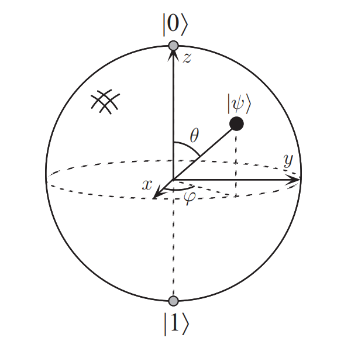{width=350 height=350}
### 2.1.2. 多量子比特
如果有n个量子比特，那这个含有n个量子比特的系统有$2^n$个基本状态（简称基矢态），同时系统的状态是基矢态的叠加态。
简单地，一个两量子比特的系统有4个基矢态，分别是$\ket{00},\ket{01},\ket{10},\ket{11}$，其量子态是将复系数（振幅）与其基矢态相乘再求和，即表示为$\ket{\psi}=\alpha_{00}\ket{00}+\alpha_{01}\ket{01}+\alpha_{10}\ket{10}+\alpha_{11}\ket{11}$。
类似于单量子比特，测量到其中一种状态的概率为其振幅的平方$|\alpha|^2$。
同时，也可测量其中一个量子比特。比如测量第一个量子比特后测量，得到0的概率为$|\alpha_{00}|^2+|\alpha_{01}|^2$，测量过后量子系统的状态为$\ket{\psi'}=\frac{\alpha_{00}\ket{00}+\alpha_{01}\ket{01}}{\sqrt{|\alpha_{00}|^2+|\alpha_{01}|^2}}$。
## 2.2. 量子比特门
###  2.2.1. 单量子比特门
量子比特门是作用于量子比特的酉变换，用酉矩阵表示，且酉性限制是量子门的唯一限制。量子门的作用是线性的。单量子比特门可以由一个$2*2$矩阵给出。

>任何酉矩阵都可以分解成$U=e^{i\alpha}\begin{bmatrix}
    e^{-i\frac{\beta}{2}}&0\\0 &e^{i\frac{\beta}{2}}
\end{bmatrix}\begin{bmatrix}
   \cos{\frac{\gamma}{2}}&-\sin{\frac{\gamma}{2}}\\\sin{\frac{\gamma}{2}}&\cos{\frac{\gamma}{2}}
\end{bmatrix}\begin{bmatrix}
    e^{-i\frac{\delta}{2}}&0\\0 &e^{i\frac{\delta}{2}}
\end{bmatrix}$。

- 经典计算机电路中唯一非平凡单比特逻辑门是非门，其作用是将$0$态和$1$态交换。基于量子门的线性性质，量子非门可以用矩阵表示：定义矩阵$X=\begin{bmatrix}
    0&1\\1&0
\end{bmatrix}$（泡利X矩阵）来表示非门。
- 类似的，还有其他量子门，比如$Z$门：$Z=\begin{bmatrix}
    1&0\\0&-1
\end{bmatrix}$、阿达玛门：$H=\frac{1}{\sqrt{2}}\begin{bmatrix}
    1&1\\1&-1
\end{bmatrix}$等重要的量子门。
### 2.2.2. 多量子比特门
有许多常用的经典比特门，例如与（AND）门、或（OR）门、异或门XOR）门、与非（NAND门）、和或非（NOR）门等。有一个重要的理论是任意布尔函数可以仅用NAND门的复合得到，所以NAND门也被称为通用门。
多量子比特门的原型是受控非（controlled-NOT或CNOT）门，此门有两个输入量子比特，分别是是控制量子比特和目标量子比特。如果控制量子比特为0，则目标量子比特不变；如果控制量子比特为1，则目标量子比特翻转。
另一种描述CNOT门的方式是将其作为经典异或门的拓展，表示为$\ket{A,B}\to\ket{A,B\oplus A}$。
CNOT门可以用矩阵$\begin{bmatrix}
    1&0&0&0\\0&1&0&0\\0&0&0&1\\0&0&1&0
\end{bmatrix}$表示。
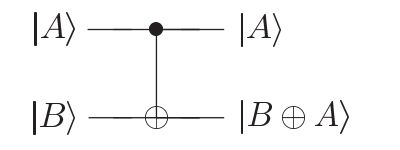{width=300}
## 2.3. 除计算基外的测量
除了$\ket{0}$和$\ket{1}$，我们可以在不同的计算基下对量子比特进行测量。原则上我们可以以任意正交基进行测量，但是为了满足概率限制，正交性是必要的。

## 2.4. 量子电路
量子电路的读法是从左到右。
一般来说电路的输入态都为基矢态
量子电路区别于经典电路有以下几种特征：
1. 电路不是环路，是非周期的
2. 量子电路不允许扇入操作
3. 量子电路不允许扇出操作
量子门用块表示。
单量子门直接将块置于电路中。
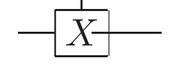{width=200}
多量子比特的量子门中，控制位由带黑点的线表示，受控位的电线上接入块或者特殊符号。
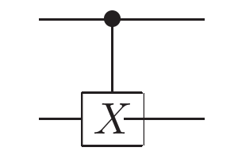{width=200}
测量是用仪表符号表示，这样会让一个单量子比特态$\psi$转化为一个经典比特$M$。
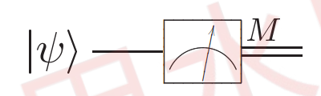{width=300}

## 2.5. 量子算法
### 2.5.1. 量子计算机的经典计算
我们可以用量子电路模拟经典逻辑电路。前面指出量子电路不能直接模拟经典电路是因为量子门作为酉算子是可逆的，而许多经典逻辑门本质上是不可逆的。此时我们可以用等价的仅含可逆原件的，由可逆门Toffolo门构成的电路代替。
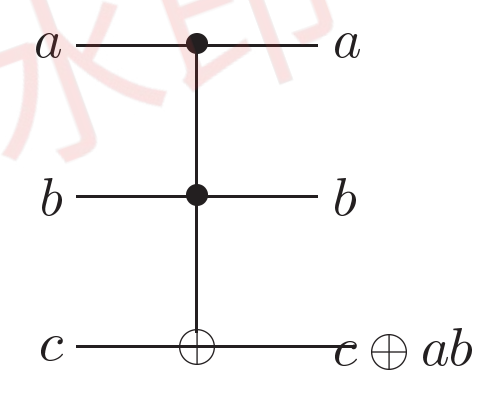{width=300}
Toffoli门含有3个输入比特，其中两个是控制比特，剩下一个是目标比特。控制比特不会受到门的作用而变换。当两个控制比特都为1时目标比特翻转，否则不变。Toffoli门能被用于模拟NAND门
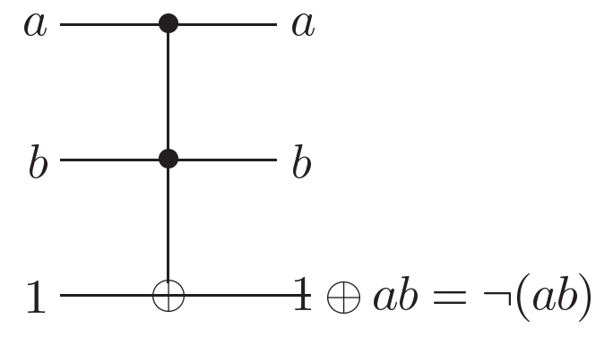{width=300}
还可以用于实现扇出
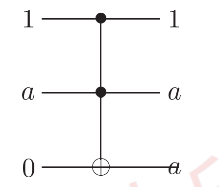{width=300}
有了这两个操作就可以模拟经典电路中的其他元件

### 2.5.2. 寄存器
先分两大类：量子寄存器 / 经典寄存器
量子寄存器再按功能分：
查询寄存器：输 入
目标寄存器：输 出
辅助寄存器：临 时
控制寄存器：管 门

### 2.5.3. 量子并行性
量子并行性是许多量子算法的基本性质，它允许量子计算机同时计算再不同$x$值下的函数值$f(x)$。
我们先考虑两量子比特的系统$\ket{x,y}$，第一个量子比特（数据寄存器$\ket{x}$）存储输入$x$（0或1），第二个量子比特（目标寄存器$\ket{y}$）用于辅助计算，初始为$\ket{0}$。
我们需要一个量子电路$U_f$使得对任意输入$x$，计算$f(x)$并将结果与$y$做模二加法（这里是异或操作$y\oplus f(x)$），即$U_f\ket{x,y}=\ket{x,y\oplus f(x)}$。因为$y=0$，所以第二个量子比特的终态始终是$f(x)$。
接着我们在数据寄存器中需要制备量子叠加态，使其同时包含$0$和$1$，具体方法是将阿达玛门$H$作用于初始态$\ket{0}_x$得到$H\ket{0}_x=\frac{\ket{0}+\ket{1}}{\sqrt{2}}$。此时整个系统可以表示为初始态$\ket{\psi_0}=H\ket{0}_x \otimes \ket{0}_y = \frac{\ket{0,0}+\ket{1,0}}{\sqrt{2}}$。
将$U_f$应用于初始态$\ket{\psi_0}$，得到$\ket{\psi}=U_f\ket{\psi_0}=U_f(\frac{\ket{0,0}+\ket{1,0}}{\sqrt{2}})=\frac{U_f\ket{0,0}+U_f\ket{1,0}}{\sqrt{2}}=\frac{\ket{0,f(0)}+\ket{1,f(1)}}{\sqrt{2}}$。
很明显，这个量子态 $\frac{\ket{0,f(0)}+\ket{1,f(1)}}{\sqrt{2}}$ 同时包含了 $f(0)$ 和 $f(1)$ 的信息，相当于一个量子操作（$U_f$）同时处理了两个输入（$0$和$1$），这就是量子并行性。
以上是1位输入的例子，当推广到任意比特的函数上时，我们对输入的n个量子比特都做阿达玛变换，制备出所有$2^n$个基态的等幅叠加：$\underbrace{H \otimes H \otimes \dots \otimes H}_{n \text{个} H}\ket{0}^{\otimes n}=\frac{\ket{0}+ \ket{1}}{\sqrt{2}}\otimes \frac{\ket{0}+ \ket{1}}{\sqrt{2}}\otimes \dots \otimes \frac{\ket{0}+ \ket{1}}{\sqrt{2}}$，展开后是：$\frac{1}{\sqrt{2^n}} (\ket{00\cdots0}+ \ket{00\cdots1}+\dots+\ket{11\cdots1})$，即$\frac{1}{\sqrt{2^n}} \sum_{x \in \{0,1\}^n}\ket{x}$。$n$个量子比特，$n$个Hadamard门，产生了$2^n$个状态的叠加态，这就是量子并行性的“指数级扩展”。
当然，由于量子叠加态的坍缩，我们在测量时也只能测量到其中一种结果。但是量子并行的价值本身不在于同时读所有结果，而在于把所有结果的信息编码到叠加态的概率幅中，获得更高效、准确的信息抽取能力。最终测量时，我们以很高的概率（甚至100%）得到全局性的答案。
### 2.5.4. Deutsch算法
- Deutsch问题：
假定一个黑箱函数$f(x):\{0,1\}\to\{0,1\}$是定义域和值域都为1比特的函数，判断其属于哪种类型
  1. 常数函数：$f(0)=f(1)$（输出始终相同）
  2. 平衡函数：$f(0)\not =f(1)$（输出随输入变化）

- 在经典计算中，我们至少需要两次调用$f(x)$函数，确定$f(0)$和$f(1)$的值并作比较。但是在量子计算中，我们可以用以下的量子电路，仅需调用一次并行计算就可以通过叠加态和干涉得到100%正确的答案。
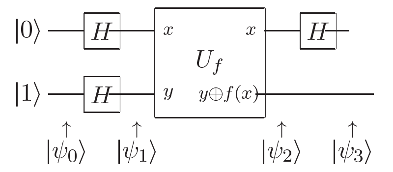{width=500}
1. 输入态$\ket{\psi_0}=\ket{01}$
2. $\ket{\psi_1}=H^{\otimes 2}\ket{\psi_0}=\frac{\ket{0}+\ket{1}}{\sqrt{2}}\otimes \frac{\ket{0}-\ket{1}}{\sqrt{2}}$
3. 将$U_f$作用在态$\ket{x}[\frac{\ket{0}-\ket{1}}{\sqrt{2}}]$上会得到$(-1)^{f(x)}\ket{x}[\frac{\ket{0}-\ket{1}}{\sqrt{2}}]$，因此对$\ket{\psi_1}$使用$U_f$操作会得到$\ket{\psi_2}=\begin{cases}
    \pm\frac{\ket{0}+\ket{1}}{\sqrt{2}}\otimes \frac{\ket{0}-\ket{1}}{\sqrt{2}},f(0)=f(1)\\\pm\frac{\ket{0}-\ket{1}}{\sqrt{2}}\otimes \frac{\ket{0}-\ket{1}}{\sqrt{2}},f(0)\not =f(1)
\end{cases}$。
1. 对数据寄存器$x$再次施加$H$门，即利用量子干涉合并不同路径的概率幅，得到$\ket{\psi_3}=\begin{cases}
    \pm\ket{0}\otimes \frac{\ket{0}-\ket{1}}{\sqrt{2}},f(0)=f(1)\\\pm\ket{1}\otimes \frac{\ket{0}-\ket{1}}{\sqrt{2}},f(0)\not =f(1)
\end{cases}$。
很容易看出，只需要测量第一个量子比特，我们就确定$f(x)$的类型。

### 2.5.5. Deutsch-Jozsa算法
- Deutsch-Jozsa问题
将其描述成如下游戏：在阿姆斯特丹的Alice从0到$2^n-1$中选择一个数x，并将其寄给波士顿的Bob，让他算出f（x）的值。Bob保证使用以下两种函数的一种
  1. f（x）对于所有的x都是同一个常数
  2. f（x）是平衡函数，即对于一半的x的取值为0，而另一半为1
Alice需要用尽可能少的通信确定Bob是哪一种函数。
- 在经典计算的情况中，在最坏的情况下Alice至少要进行$2^{n-1}+1$次通讯，因为在最终收到一个1之前可能会收到$2^{n-1}$个0.
- 在量子计算条件下，Alice用n量子比特寄存器来储存她的输入，给Bob一个单量子比特来储存答案。他们的量子比特分别对应查询寄存器和答案寄存器。
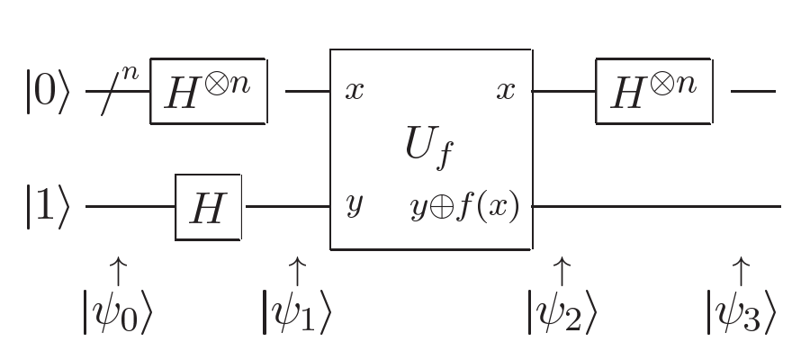{width=500}
1. 输入态$\ket{\psi_0}=\ket{0}^{\otimes n}\ket{1}$
2. 制备叠加态，对$n$个查询寄存器和1个目标寄存器分别应用$H$门：$\ket{\psi_1}=H\ket{\psi_0}=\frac{1}{\sqrt{2^n}} \sum_{x=0}^{2^n - 1}\ket{x}\otimes \frac{\ket{0}-\ket{1}}{\sqrt{2}}$
3. 对$\ket{\psi_1}$使用$U_f$操作，将结果编码到目标寄存器的相位中，通过相位反冲，得到$\ket{\psi_2}= \frac{1}{\sqrt{2^n}}\sum_{x=0}^{2^n - 1} (-1)^{f(x)} \ket{x}\otimes \frac{\ket{0}-\ket{1}}{\sqrt{2}}$。
4. 对查询寄存器$x$再次施加$H$门，利用干涉提取信息，由于$H^{\otimes n}\ket{x}=\frac{\sum_z(-1)^{x·z}\ket{z}}{\sqrt{2^n}}$，可以得到$\ket{\psi_3}=\sum_z\sum_x\frac{(-1)^{x·z+f(x)}\ket{z}}{2^n}[\frac{\ket{0}-\ket{1}}{\sqrt{2}}]$。
我们只需要对查询寄存器进行一次测量，若结果为$\ket{0}^{\otimes n}$，则$f(x)$是常函数；若结果为非$\ket{0}^{\otimes n}$，则$f(x)$是平衡函数。

### 2.5.6. 量子傅里叶变换
#### 2.5.6.1. 离散傅里叶变换和量子傅里叶变换
离散傅里叶变换(DFT)将将长度为$N$的离散序列$x[n],n\in\{0,1,\dots,N-1\}$变换为长度相同的离散序列$y[k]$，满足$y_k=\frac{1}{\sqrt{N}}\sum_{n=0}^{N−1}​x_ne^{2\pi ink/N}​$。
而量子傅里叶变换(QFT)则是与离散傅里叶变换形式相同的变换，而它的变换是定义在一组标准正交基$\ket{0},\dots,\ket{N-1}$上的一个线性算子，它的作用是$QFT(\ket{j})=\frac{1}{\sqrt{N}}\sum^{N-1}_{k=0}e^{2\pi ijk/N}\ket{k}$，可以等价的写成$QFT(\sum^{N-1}_{k=0}x_k\ket{j})=\sum^{N-1}_{k=0}y_k\ket{k}$，其中振幅$y_k$是由振幅$x_j$通过离散傅里叶变换得来的。
>如果我们取$N=2^n$，其计算基为$\ket{0},\ket{1},\dots,\ket{2^n-1}$，方便起见，我们将状态$\ket{j}$写成二进制形式$j=j_1j_2\dots j_n,j_n\in \{0,1\}$，在数学上$j=\sum_kj_k2^{n-k}$，同时我们用$0.j_1j_2\dots j_m=\sum_i^m\frac{j_i}{2^i}$来表示二进制小数。
通过运算我们可以得到量子傅里叶变换的乘积形式$QRT(\ket{j_1\dots j_n})=\frac{(\ket{0}+e^{2\pi i0.j_n}\ket{1})(\ket{0}+e^{2\pi i0.j_1j_{n-1}j_n}\ket{1})\dots(\ket{0}+e^{2\pi i0.j_1j_2\dots j_n}\ket{1})}{2^{n/2}}
=\frac{(\ket{0}+e^{2\pi i0.j_n}\ket{1})(\ket{0}+e^{2\pi i0.j_1j_{n-1}j_n}\ket{1})\dots(\ket{0}+e^{2\pi i0.j_1j_2\dots j_n}\ket{1})}{2^{n/2}}$。

#### 2.5.6.2. 量子傅里叶变换的简单电路
在此我们定义门$R_k=\begin{bmatrix}1&0\\0&e^{2\pi i/2^k}\end{bmatrix}$。
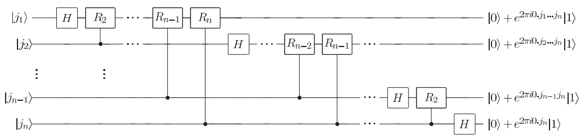

#### 2.5.6.3. 相位估计

### 2.5.7. 量子搜索算法

- 给定一个数据量为$N$的无序数据库$D$，在此数据库中找到满足条件的数据$x$，满足$f(x)=\begin{cases}1,x\in P\\0,others\end{cases}$，其中$P$为$D$的子集，也是我们的目标集。
#### 2.5.7.1. 预言机（黑箱）
要在一个包含$N$个元素的集合中搜索$M$个解（满足$1\leq M\leq N$）。为了通用性，我们关注索引而非元素本身，索引$x$的范围是$0\leq x<N$，对应排序从$0$到$N-1$的元素。为了方便，我们假设$N=2^n$，这样我们可
可以把所有索引用2进制储存在n个量子比特中。
搜索问题的一个简单特例可以表示为一个函数$f(x)=\begin{cases}
    1,x\in M\\0,others
\end{cases}$。
假设我们有预言机（Oracle），它是一个酉算子$O$，它对索引（查询）寄存器$\ket{x}$和预言机比特（目标储存器）$\ket{q}$的作用为：$O(\ket{x}\ket{q})\ket{x}\ket{q\oplus f(x)}$。当我们预先将语言机比特制备成$\ket{+}$，类似于Deutsh-Jozsa算法，通过量子反冲我们可以得到$O(\ket{x}(\frac{\ket{0}-\ket{1}}{\sqrt{2}}))=(-1)^{f(x)}\ket{x}\frac{\ket{0}-\ket{1}}{\sqrt{2}}$。此时我们说语言机改变了解的相位，标记了搜索问题的解。

#### 2.5.7.2. Grover算法
1. 算法开始于状态$\ket{0}^{\oplus n}$，使用$H^{\oplus n}$使其变为均匀叠加态$\ket{\psi}=\frac{1}{\sqrt{N}}\sum_{x=0}^{N-1}\ket{x}$。
2. 反复操作Grover迭代（记为$G$），其作用可以分成以下四个步骤：
    $\textcircled{1}$：作用Oracle。
    $\textcircled{2}$：作用$H^{\oplus n}$。
    $\textcircled{3}$：执行条件相位偏移，其对应的酉算子为$2\ket{0}\bra{0}-I$，使除$\ket{0}$之外的每个计算基矢态都获得一个$-1$的相位偏移，即$(2\ket{0}\bra{0}-I)(\ket{x})=(-1)^{\delta_{x_0}}\ket{x}$。
    $\textcircled{4}$：再次作用$H^{\oplus n}$。
    （步骤$\textcircled{2}$、$\textcircled{3}$、$\textcircled{4}$实际上可以写成$H^{\oplus n}(2\ket{0}\bra{0}-I)H^{\oplus n}$，即2\ket{\psi}\bra{\psi}-I，故$G=(2\ket{\psi}\bra{\psi}-I)O$）

>操作$(2\ket{\psi}\bra{\psi}-I)$作用在一般的状态$\sum_k\alpha_k\ket{k}$上会得到$\sum_k[-\alpha_k+2<\alpha>]\ket{k}$，其中$<\alpha>$是$\alpha_k$的均值。因此$\sum_k\alpha_k\ket{k}$有时被称为关于均值的反演操作。

#### 2.5.7.3. Grvoer算法的几何可视化
有了$G=(2\ket{\psi}\bra{\psi}-I)O$，我们可以证明Grover迭代可以被视为一个二维空间的旋转，这个空间由初始态$\ket{\psi}$和搜索问题中解的均匀叠加态张成。
用$\sum'_x$表示在搜索问题中所有解的和，$\sum''_x$表示在搜索问题中所有非解元素的和。同时定义归一化状态$\begin{cases}\ket{\alpha}=\frac{1}{\sqrt{N-M}}\sum''_x\ket{x}\\\ket{\beta}=\frac{1}{\sqrt{M}}\sum'_x\ket{x}\end{cases}$。故初始态$\ket{\psi}$可以被表示为$\ket{\psi}=\sqrt{\frac{N-M}{N}}\ket{\alpha}+\sqrt{\frac{M}{N}}\ket{\beta}$。
### 2.5.8. 量子模拟

# 3. 量子计算模型
## 3.1. 量子图灵机模型
## 3.2. 量子线路模型
## 3.3. One-way量子计算
### 3.3.1. 图态
One-way量子计算的系统初始状态是一个具有特殊结构的标准多体纠缠态，通常被称为图态（graph state）或者簇态（cluster state），用$\ket{G}$表示。而不同的量子算法则体现在单比特测量的顺序以及测量基上。

#### 3.3.1.1. 无向图

任给一个简单的无向图$G$,它由顶点集合$V$和边集合$E$确定，记为$G_{\{V,E\}}$。如果两个顶点a和b被一条边$E_{ab}$连接,我们就称顶点a与顶点在图$G$中相邻(在简单图中,所有顶点不与自身相邻)。根据$G$中顶点间的相邻关系,可以定义相邻矩阵$\Gamma$，它是一个$n*n$的矩阵，$n$为图$G$中顶点的个数，若顶点$a$和$b$相邻,则$\Gamma_{ab}=1$,反之，$\Gamma_{ab}=0$。在简单图中$\Gamma_{aa}=0$。
每个图态$\ket{G}$都可与一个简单的无向图$G$完全对应。若在图$G$的每个顶点$a$处放置一个量子比特,那么,我们就可以建立图$G(V,E)$与图态$\ket{G}$间的对应关系。
#### 3.3.1.2. 图态的显式定义
图态的显式定义直接给出图态的具体制备方法：
1. 将图$G_{\{V,E\}}$所有顶点上的量子比特都制备到初始状态$\ket{+}$，得到$\ket{G}=\ket{+}^{\oplus V}$。
2. 定义$CZ=\begin{bmatrix}
    1&0&0&0\\0&1&0&0\\0&0&1&0\\0&0&0&-1
\end{bmatrix}$（其作用是只有当两个量子比特都处于$\ket{1}$时，整体相位倒转，其他情况完全不变），同时定义$S_C$对每一对的相邻顶点做$CZ$门，对初始态做$S_C$操作，得到量子态$\ket{G}=S_C(\ket{+}^{\oplus V})=
\prod_{\{a,b\}\in E}CZ_{ab}(\ket{+}^{\oplus V})$。
#### 3.3.1.3. 图态的隐式定义
图态的隐式定义是通过一组稳定子(stabilizer)算符的共同本征态来定义，它简便地给出图态的性质。
对一个给定的图$G_{V,E}$,在每个顶点a上定义一个与之对应的稳定子算符$K_a=\sigma_a^x\prod_{b\in N_a}\sigma_b^z$，其中$\sigma_k^i(i=x,y,z)$表示作用于量子比特$k$上的泡利算符,而$N_a$表示与顶点$a$相邻的顶点集合，由此形成独立算符集合$\{K_a,a\in V\}$。
我们容易证明，任意两个稳定子算符都是对易的。

# 4. 量子信息
## 4.1. 量子噪声
真实的量子系统不可避免地遭受与外界的相互作用，这种相互作用造成的后果在量子信息处理系统中显示为噪声。寻找环境及系统-环境相互作用的模型是我们在经典和量子噪声研究中的基本程序。
### 4.1.1. 马尔可夫过程
马尔可夫过程指的是无记忆的随机过程，即下一刻的状态只由现在的状态决定，和之前的历史没关系。
对于一个单量子比特，假设$p_0$和$p_1$是比特分别处于状态$0$和$1$的初始概率。令$q_0$和$q_1$为噪声发生后相应的概率。设$X$为该比特的初始状态，$Y$为该比特的最终状态。于是总概率定律为$p(Y=y)=\sum_xp(Y=y|X=x)p(X=x)$，写成向量形式有$\begin{bmatrix}
    q_0\\q_1
\end{bmatrix}=\begin{bmatrix}
    1-p&p\\p&1-p
\end{bmatrix}\begin{bmatrix}
    p_0\\p_1
\end{bmatrix}$。

经典系统中的噪声可以用随机过程理论来描述。对于单阶段过程,输出概率$\vec{q}$通过等式$\vec{q}=E\vec{p}$于输入概率$\vec{p}$联系起来。

### 4.1.2. 量子主方程
- 林德布拉德主方程（GKS-L 方程）：当满足以下两个核心假设时
1.系统和环境弱耦合，系统本身不会剧烈改变
2.处于马尔可夫（无记忆）环境，则有
$$\frac{d\rho}{dt}=-\frac{i}{\hbar}[H,\rho]+\sum_k\gamma_k[L_k\rho L_k^\dagger-\frac{1}{2}\{L_k^\dagger L_k,\rho\}]$$
其中：
1.$-\frac{i}{\hbar}[H,\rho]$表示系统自身的幺正演化，即冯・诺依曼方程，对应没有环境干扰的理想情况。
2.$\sum_k\gamma_k[L_k\rho L_k^\dagger-\frac{1}{2}\{L_k^\dagger,\rho\}]$表示环境导致的耗散，它是林德布拉德方程的核心，描述系统和环境耦合时的非幺正效应（比如能量流失、量子相干性消失）。
$L_k$：林德blad算子（也称跳跃算子）。它们描述了具体的耗散过程是什么。
$\gamma_k$：这是与每个$L_k$相关的速率。它决定了这个过程发生的快慢。
$L_k\rho L_k^\dagger$：这个项负责把布居数从一个态转移到另一个态，并引入随机性。
v林德布拉德主方程表示
量子比特一边在磁场里自旋进动
系统的量子叠加态慢慢消失，变成经典的的混合态
系统把能量传给环境，从高能态掉到低能态

## 4.2. 量子操作
量子操作形式体系是描述量子系统在各种情况下演化的一般工具。我们用密度矩阵$\rho$来描述量子态，$\rho'=\mathcal{E}(\rho)$即为量子态的变换，$\mathcal{E}$即为一个量子操作。
### 4.2.1. 环境与量子操作
描述开放量子系统一种方式是将其视为主系统与环境之间的相互作用产生一个封闭的量子系统。通常而言，处于状态$\rho$的系统与环境耦合后，其最终形态$\mathcal{E}(\rho)$与初始态$\rho$的酉变换无关。
我们假设整体系统为直积态$\rho\oplus\rho_{env}$，在经过量子操作$\mathcal{E}$后主系统与环境不再交互，因此我们对环境求偏迹以获得约化后的系统状态：$\mathcal{E}(\rho)=tr_{env}[U(\rho\oplus\rho_{env})U^{\dagger}]$。

### 4.2.2. 算子和表示

# 5. 量子编程
# 6. 量子计算设备
## 6.1. 指导性原则
制造一台量子计算机的基本单元是量子比特。